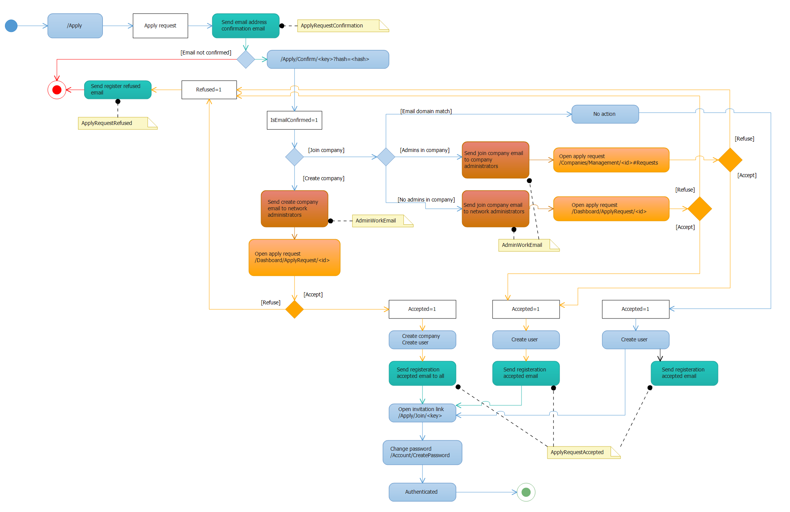

* [Index](0000-Index.md)
* [Features implementation](5000-Features-implementation.md)

Apply process
=========================================

This is the new registration process for users and companies.

Goal: simplify the registration process.
-------------------------------------------

### Observed issues

When registering with a new company, the process is not easy. You try to /Account/RegisterRequest and it says you have to create the company first. You fill /Companies/Registration, receive an email, then receive two emails. When clicking in the right email, you have to register your user account, pass through /quickstart. That's long!

### We are building a 1-form process

You fill just one form that will ask you basic data about you and your company.

It can be extended statically or dynamically to fit each network's needs.

### With the help of LinkedIn

You can also register using your LinkedIn profile. This allows to fill most of the form fields.

Process
-------------------------------------------

### Fill /Apply

The form asks for basic user info and company details.

### Registered company

If the user's email domain matches the company's email domain, the user should receive a confirmation email. Clicking the link will ask the user to change is password. The user will join the network directly.

If the user's email domain does not match the company's email domain, the company administrators will receive an email to validate the user. When validated, the user 

1 email is sent to company/network administrators 

Emails
-------------------------------------------

### Confirmation email

Contains a link that validates the email address.
The link will ask the user to type a password.
The user will be authenticated after setting his/her password.

### User join company email

The company's administrators receive some information about the person who filled the form.
Administrators have direct links to allow/deny the request.
If there are no administrators in the company, the network's administrators receive the same email.

Dev
-------------------------------------------

- [x] Apply process
- [x] Admin accept
- [x] Admin refuse
- [x] Apply requests in company management
- [x] Apply email templates sexy
- [x] Preselection company
- [x] Si user summary est vide, utiliser summary du premier job courant
- [x] Rediriger correctement /Account/RegisterRequest vers /Apply
- [x] Forcer le choix du genre
- [x] Sélecteur timezone à faire à la main
- [x] Souci validation/onglets 
- [x] TimezoneAttribute @Antoine
- [x] Redirect from /Apply to /Apply?Key=xxxx-xx-xx-xxxx
- [x] Default values for Culture/Timezone
- [x] ne pas demander le gender 
    - [x] Features.Users.DefaultGender=Unspecified
    - [x] CSS to hide 
    - [x] Make sure the user is created with Gender=Unspecified 
    - [x] When invited, make sure the user is created with Gender=Unspecified 
- [x] When using linkedin, match companies by name to join instead of create
- [x] On invalid submit, pre-select the company that was previously selected
- [x] Check item status in domain methods
- [x] /Companies/Management fix count apply requests
- [x] /Apply/Details css review
- [x] Ajouter un waiting lorsqu'on clique sur S'inscrire avec LinkedIn
- [x] Tests, tests, tests, tests, tests, tests, tests, tests and tests again
- [x] Erreur 500 lorsqu'on affiche /apply/details sans clé. -> Si pas de clé, il faut rediriger vers Register, c'est mieux
- [x] Masquer le bouton LinkedIn Connect si LinkedIn Connect n'est pas configuré sur le réseau

