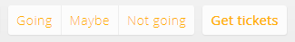

Events
==============

It is the best way to communicate about upcoming events and engage the members to join. Anyone can *create* an event on the network to promote it. Upcoming events are displayed in the newsletter and on the homepage to make sure everyone sees them before it is too late.

Creating an event
-------------------

In the events section, you will easily find buttons to create a new event.

The form will ask you information about the event you want to promote.

* Name
* Description ([free formatable text](TextFormat.en.md))
* Category
* Audience
* Start and end dates
* Information website
* Ticketing or reservation website
* Place
* Time zone

You may change the event details until the event has not happened. After the end date, you cannot change it.

### Event name and description

The name and the beginning of the description will be displayed in many places. Make sure to type a relevant name and start your description with a short pitch.

### Start and end date

You have to tell when the event is occurring. This will help the system in various ways:

* display only future events in listings
* display upcoming events on the homepage
* display past events in the "past events" page

Make sure the time you specify match the selected time zone at the end of the form. 

### Category

Conference, afterwork, exposition, outing, workshop, sports meeting, training... This will help your audience to identify the kind of event.

### Audience ("for")

Choose who will be able to see the event:

* just you, so you can pick who you want to invite
* one of your [groups](Groups.en.md)
* the whole network
* your [company members](Companies.en.md)
* everyone, including the network and anonymous users

### Website and tickets

**If your event requires to buy or acquire a ticket to join, it is important to specify the URL to get a ticket.** A button will appear to invite the user to get a ticket. If you forget this, your audience may come unexpected to your event (without a ticket) because it was not clear a ticket was required. You may recall the need for a ticket in the event description to ensure users are aware they need a ticket to join.

You may also specify a website where more information about the event is available.

### Place

Choosing a place will display a small map to locate the event. It will also help users identify events nearby them.

Your network has a list of [places](Places.en.md) that are relevant to the community. When choosing a place for your event, you will be able to choose the it. If the place does not seem to exist, search for it. You will get a list of places from our partners.

When selecting a place that does not exist in the network, the place details will be imported from a partner database. No need to put the details yourself. There is a way to create a place manually.   

### Time zone

This field contains the default time zone relevant to the community. If you want to create an event located in a different time zone, choose the relevant time zone. In this case, you have to choose the time of the event in the selected time zone.

All dates and times on the network are displayed using your preferred time zone or the network's time zone if you omitted the choice. The current time zone always appears at the bottom of the site's pages.

The event page
--------------------

The event page promotes your event. All the details from the create form are here.

Users can:

* contribute using the integrated [timeline](Timelines.en.md); 
* RSVP (indicate their participation)
    * *going* means the user has planned to come
    * *maybe* means the user may or may not come
    * *not going* means the user will not come 

The event members
---------------------

Based on the RSVPs, the event creator and network administrators can see the list of coming people.

If the event is or was public (audience), anonymous users may appear in the lists.

You can print a list of the users using your web browser. The keyboard shortcut `Ctrl+P` should do the trick.

There is also an export button to download a CSV file (open it in a spreadsheet editor).

Invite
---------------

You can invite users to join your event. They will receive an email and a [notification](Notifications.en.md).

Repeat the event
-----------------------

The event is occurring again? Save some time, use the repeat button in the past event. This will lead you to the create form with all fields copied from the past event. You only need to change the date!
