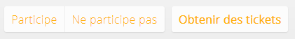

Evénements
==============

C'est le meilleur moyen d'engager les utilisateurs à rejoindre un événement. Tous les utilisateurs peuvent *créer* des événements sur le réseau et le promouvoir. Les événements proches sont affichés sur la page d'accueil et dans la newsletter afin qu'aucun membre ne passe à coté.

Créer un événement
-------------------

Dans la section des événements, vous trouverez facile un des liens permettant la création.

Le formulaire va demander des informations sur l'événement à créer.

* Nom
* Description ([texte libre formattable](TextFormat.fr.md))
* Catégorie
* Audience
* Date et heure de début et de fin
* Site web d'information
* Site web d'achat de ticket ou de réservation
* Lieu
* Fuseau horaire

Vous pourrez changer les détails de l'événement tant qu'il n'est pas révolu. Passé la date de fin, vous ne pourrez plus le modifier.

### Nom et description

Le nom de l'événement et le début de sa description vont apparaître à de multiples endroits. Assurez-vous que le nom est pertinent et que le début de la description contient quelques phrases d'accroche. 

### Date et heure de début et de fin

Il faut définir quand l'événement va survenir. Cela va aider le système à :

* n'afficher que les événements futurs dans les listes, 
* afficher les événements proches dans la newsletter et sur la page d'accueil, 
* permettre l'accès à l'historique des événements sur la page dédiée.

Vérifiez que l'heure de l'événement correspond au fuseau horaire en fin de formulaire. 

### Catégorie

Conférence, afterwork, salon, sortie, atelier, rencontre sportive, formation... La catégorie va aider les membres de la communauté à déterminer le type de rencontre.

### Audience ("pour")

Choisissez qui pourra voir l'événement :

* seulement vous, invitez les personnes individuellement ;
* un de vos [groupes](Groups.fr.md) ;
* le réseau complet (tous les membres) ;
* les membres de votre [entreprise](Companies.fr.md) ;
* tout le monde, incluant les membres et les visiteurs anonymes.

### Site web et tickets

**Si votre événement nécessite l'acquisition ou l'achat d'un ticket d'entrée, il est important de spécifier l'adresse de la page permettant l'obtention du ticket.** La fiche comportera alors un bouton de réservation. En cas d'oubli, les utilisateurs intéressés risquent de se présenter à l'événement sans ticket car il n'aura pas été mentionné clairement qu'il fallait réserver. Ne pas hésiter à rappeler la nécessité de l'achat d'un ticket dans la description de l'événement.

Il est possible de spécifier l'adresse d'un site web pour obtenir plus d'informations sur l'événement.

### Lieu

Choisir le lieu affichera une petite carte dans la fiche de l'événement. Cela aidera les membres à trouver les événements à proximité.

Le réseau comporte une liste de [lieux](Places.fr.md) qui sont pertinents pour la communauté. Lors du choix du lieu, cette liste apparaît. Si le lieu n'existe pas, il suffit de faire une recherche : des descriptifs de lieux sont proposés par nos partenaires.

Lors de la sélection d'un lieu qui n'existe pas dans le réseau, le descriptif du lieu est automatiquement importé depuis la fiche du partenaire. Cela permet d'éviter la saisie manuelle du descriptif du lieu. Il est aussi possible de créer un nouveau lieu manuellement.   

### Fuseau horaire

Ce choix est présélectionné sur le fuseau du réseau. Pour créer un événement dans un autre fuseau horaire, il suffit de sélectionner le bon fuseau et de saisir l'heure de l'événement dans le fuseau correspondant.

Les dates et heures sur le réseau s'affichent toujours dans votre fuseau horaire préféré ou celui du réseau si nous n'avez rien choisi. Le fuseau courant est rappelé en bas de toutes les pages du site.

La page de l'événement
--------------------

Celle ci sert à promouvoir l'événement et à collaborer. Tous les détails de l'événement y figurent.

Les membres peuvent :

* contribuer à l'aide du [flux de conversation](Timelines.fr.md) intégré ; 
* indiquer leur participation. 

Les participants
---------------------

Sur la base des réponses des membres, le créateur de l'événement et les administrateurs du réseau ont accès à la liste des participants.

Si l'événement est ou a été public, des personnes non-membres peuvent s'être inscrites aussi.

Vous pouvez imprimer une liste des participants à l'aide de votre navigateur web. La raccourci clavier `Ctrl+P` devrait lancer l'impression.

Il est aussi possible d'exporter une liste au format CSV (à ouvrir dans un logiciel tableur).

Inviter
---------------

Il est possible d'inviter des membres à rejoindre l'événement. Ils recevront un email et une [notification](Notifications.fr.md).

Répéter l'événement
-----------------------

L'événement se produit à nouveau ? Gagnez du temps, utilisez le bouton "répéter". Un formulaire de création d'événement va apparaître pré-complété à l'aide des informations de l'événement à répéter. Il ne reste qu'à changer la date...

